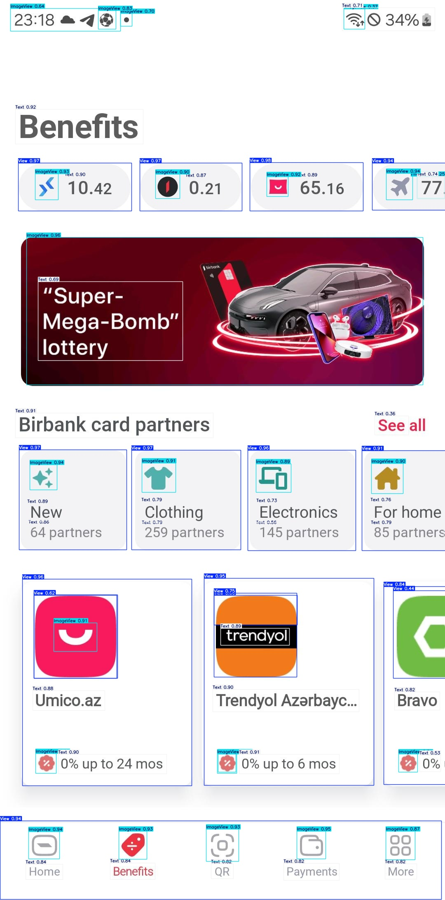
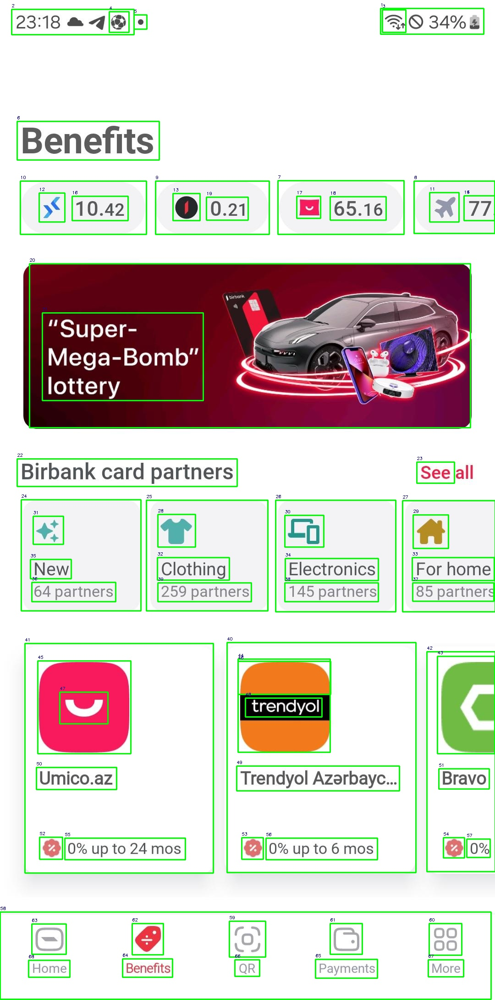

# deki

**deki** is an ML model (or several models) that detects UI elements in screenshots (such as containers, text, and icons) and provides structured descriptions of those elements. It can help with:

- Generating code for LLMs that need structured UI information.
- Automating device interactions by providing precise bounding box coordinates.
- Assisting visually impaired users by describing the UI.

---

## How It Works

1. **Object Detection**  
   Runs YOLO (trained to detect `View` containers, `Text`, `ImageView` icons/images, and `Line` elements) on the input image.

2. **Cropping & Processing**  
   - **Text boxes**: Crop each box and use a deep neural network (DNN) to enhance the text region, then perform OCR (by using EasyOCR) and apply a spell checker to correct mistakes.  
   - **View/Line boxes**: Extract background color and alpha information.  
   - **ImageView boxes**: Determine if the element is an icon-like graphic or a real image (e.g., a person or a car).

3. **Image Captioning (Optional)**  
   Use an image captioning model (e.g., BLIP-2, LLaMA-vision, etc.) to produce an overall description of the screenshot content.

---

## Where It Can Be Used

The ML model creates a long description of the screenshot that can be used for various purposes:

1. **Code Generation**: Provide structured UI details for LLMs that don't have vision-based input or their vision capabilities are limited.  
2. **Device Control**: Automate interactions by detecting exact coordinates of all elements.  
3. **Accessibility**: Help visually impaired users understand the UI structure.

---

## Usage

Install dependencies (Python 3.12 recommended):

```bash
pip install -r requirements.txt
```

Full Pipeline

```bash
python3.12 wrapper.py \
  --input_image ./bb_1.jpeg \
  --weights_file ./best.pt \
  --icon_detection_path ./icon-image-detection-model.keras
```

YOLO-Only

```bash
python3.12 yolo_script.py \
  bb_1.jpeg \
  ./best.pt
```

And don't forget to include your HuggingFace and OpenAI tokens if you use blip2 or ChatGPT.

Also, to use this version you need to install llama-3.2-11b via ollama.

---

## Examples

You can see examples in the result/ and output/ folders.

Bounding boxes with classes:


Bounding boxes without classes but with IDs after NMS:


Text output will look something like this:
```text
Image path: ./bb_1.jpeg
Image Size: width=1080, height=2178
********
View: region_1_class_0 (View)
Coordinates: x_min=606, y_min=393, x_max=881, y_max=510
Size: width=275, height=117
1. The background color of the container is whitesmoke.
2. The container is opaque.
********
...
********
Image: region_8_class_1 (ImageView)
Coordinates: x_min=64, y_min=574, x_max=1026, y_max=931
Size: width=962, height=357
Prediction: Normal Image
The image appears to be an advertisement for a lottery, with the title "Super-Mega-Bomb" Lottery prominently displayed at the top. The background of the image features a bold red color scheme.

* A car:
	+ The car is depicted in black and white.
	+ It is positioned centrally in the image.
	+ The car appears to be a sleek, modern vehicle.
* A phone:
	+ The phone is shown in the bottom-right corner of the image.
	+ It has a red screen with a pink background.
	+ The phone's design suggests it may be a high-end model.
* A credit card:
	+ The credit card is displayed in the top-left corner of the image.
	+ It features a black and red color scheme.
	+ The credit card appears to be from "bitbank".
* Other objects:
	+ There are several other objects scattered throughout the image, including a tablet, a pair of earbuds, and a small device with a screen.
	+ These objects appear to be related to technology or electronics.

Overall, the image suggests that the lottery offers prizes that include high-end electronic devices and vehicles. The use of bright colors and modern designs creates a sense of excitement and luxury, implying that the prizes are valuable and desirable.
********
...
********
Text: region_38_class_2 (Text)
Coordinates: x_min=69, y_min=1268, x_max=252, y_max=1310
Size: width=183, height=42
Extracted Text: 64 partners
Corrected Text: 64 partners
********
```

I have not used the best examples that do not have errors, so as not to give
people a false impression of the accuracy of the model. The examples you see
are approximately the standard result that can usually be obtained using this
model.

---

## Future plans

    1. Make the image captioning functionality optional.
    2. Increase accuracy of the YOLO model (current model was trained on only 486 images).
    3. Increase accuracy of the icon detection model by improving training data quality.
    4. Fine-tune the image captioning model for more accurate UI descriptions.
    5. Fine-tune an LLM for generating UI code from detected elements.

---

## Contributing

Pull requests are welcome! 

---

## License

GPLv3
